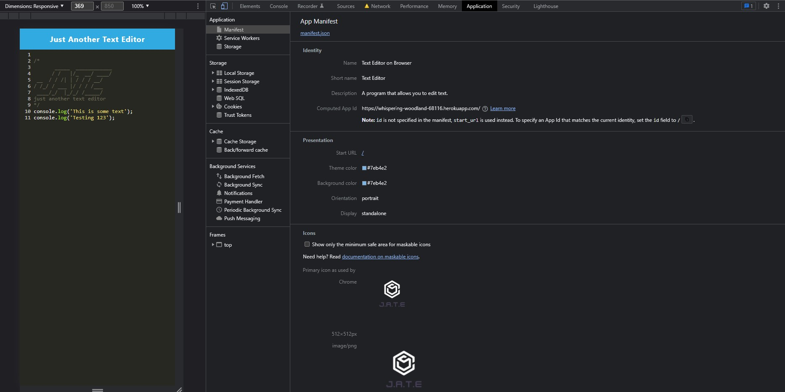
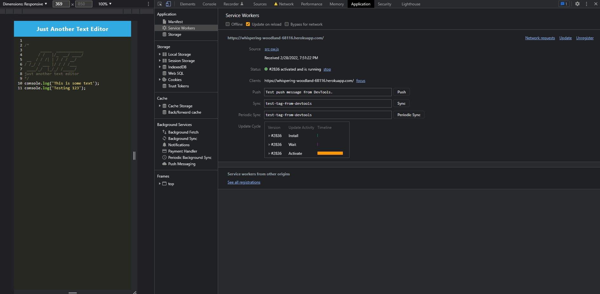
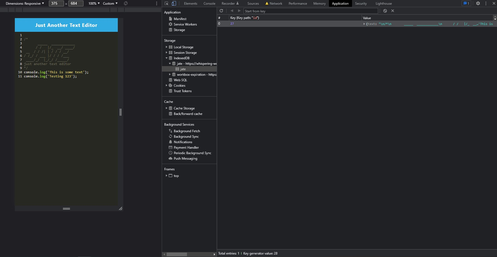

# my-own-text-editor

The focus of this app is to build a single-page editor that runs on the browser. The application can also run offline.

## Built With

* [HTML](https://developer.mozilla.org/en-US/docs/Web/HTML)
* [CSS](https://developer.mozilla.org/en-US/docs/Web/CSS)
* [Javascript](https://developer.mozilla.org/en-US/docs/Web/JavaScript)
* [Webpack](https://www.npmjs.com/package/webpack)

## Deployed Link

* [See Live Site](https://whispering-woodland-68116.herokuapp.com/)

# Screenshots and Gif

Demonstration of viewing and typing in the text editor. The IndexedDb saves the data even when offline and the data persists.

This image shows the app's manifest.json file.

This image shows the app's registered service worker.

This image shows the app's IndexedDB storage. The key starts off at the value '1', but development and testing caused the screenshot to have an increased value. This value should always start at '1' when beginning to use the app.

## Authors

* **Bradley Le** 

- [Link to Portfolio Site](https://pentazoned.github.io/portfolio-version-3/)
- [Link to Github](https://github.com/PentaZoned)
- [Link to LinkedIn](https://www.linkedin.com/in/bradley-le-/)

## License

This project is licensed under the MIT License 
